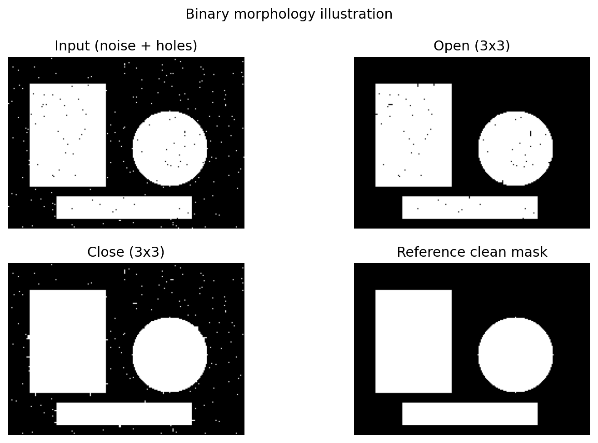
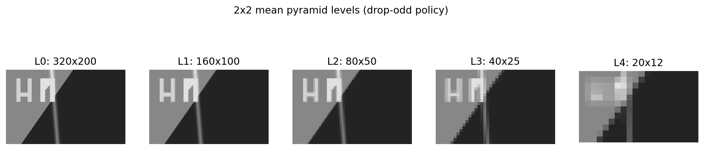
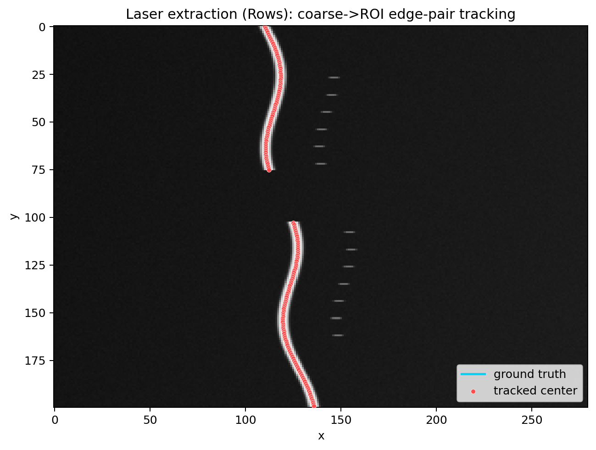

[](https://github.com/VitalyVorobyev/vision-metrology/actions/workflows/ci.yml)
[](https://github.com/VitalyVorobyev/vision-metrology/actions/workflows/audit.yml)
[](https://github.com/VitalyVorobyev/vision-metrology/actions/workflows/publish-docs.yml)

# vision-metrology

Rust workspace for industrial machine-vision metrology.

## Current status
- `vm-core` implemented and tested (image views, sampling, geometry).
- `vm-pyr` implemented and benchmarked (fast 2x2 mean downsample, reusable f32 pyramid).
- `vm-edge` implemented and tested (1D DoG edges + edge-pair selection, and single-scale 2D edgel extraction with subpixel refinement along normal).
- `vm-laser` implemented and tested (row/column laser line extraction with ROI + prior tracking).
- `vm-contour` implemented and tested (junction-aware contour graph extraction with T/Y support and loop handling).
- CI, audit, and docs workflows are configured in GitHub Actions.

## Crates
- `vm-core`: image views, sampling/interpolation, geometry primitives.
- `vm-contour`: topology + polyline graph extraction from 2D edgels (junction-aware tracing, loop support).
- `vm-edge`: robust 1D DoG edge extraction + edge-pair primitive, and 2D edgel detection (Scharr + NMS + hysteresis + subpixel).
- `vm-gallery`: external-fixture gallery executor (CLI) that writes raw artifacts for plotting.
- `vm-laser`: industrial laser line extraction using edge-pair tracking (rows/cols/transposed).
- `vm-morph`: small binary morphology primitives (3x3 open/close).
- `vm-pyr`: fast 2x2 mean downsample and reusable f32 image pyramid.
- `vision-metrology`: umbrella crate re-exporting workspace crates.

## Quick start
```bash
cargo test
```

## Gallery
Generated by external fixtures + Rust raw outputs + Python plotting:

```bash
python tools/gallery/run_all.py
```

Interactive viewer (build + show all final figures):

```bash
python tools/gallery/show_figures.py
```
: default is one-figure-at-a-time browsing (not collage).

Show one required use case on a single canvas:

```bash
python tools/gallery/show_figures.py --case edgels2d
```

Keyboard browsing mode:

```bash
python tools/gallery/show_figures.py --mode browse
```

See `docs/FIGURES.md` for the full pipeline and output layout.







## Benchmarks
Run all workspace benchmarks:
```bash
cargo bench --workspace
```

Run all `vm-pyr` benchmarks:
```bash
cargo bench -p vm-pyr
```

Run only the downsample benchmark target:
```bash
cargo bench -p vm-pyr --bench downsample
```

Run only the specific downsample benchmark function:
```bash
cargo bench -p vm-pyr --bench downsample -- downsample2x2_mean_u8_to_f32_1280x1024
```

Run `vm-laser` benchmarks:
```bash
cargo bench -p vm-laser
```

Run `vm-edge` benchmarks:
```bash
cargo bench -p vm-edge --bench edge2d
```

Run `vm-contour` benchmarks:
```bash
cargo bench -p vm-contour --bench build_graph
```

### Benchmark snapshot
Measured via `cargo bench --workspace` on 2026-02-08 (local machine, Criterion defaults):

| Benchmark | Time (approx) |
|---|---:|
| `vm_pyr::downsample2x2_mean_u8_to_f32_1280x1024` | `38.20 us` |
| `vm_pyr::pyramid_build_u8_6_levels_1280x1024` | `122.6 us` |
| `vm_laser::rows_1280x512` | `2.10 ms` |
| `vm_laser::cols_gather_512x1280` | `146.1 us` |
| `vm_edge::edge2d_detect_u8_1280x1024` | `5.52 ms` |
| `vm_contour::vm_contour_build_graph_50k` | `3.70 ms` |

Numbers vary by CPU, toolchain, thermal state, and background load.
